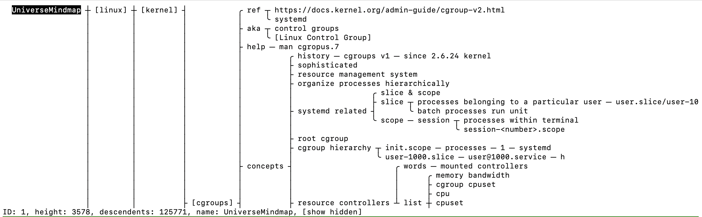

# UniverseMindmap — High-Performance Knowledge Engine

UniverseMindmap is a high-performance knowledge engine written in **pure C**, capable of handling **over 1M nodes** with ease — far more than most people will ever write down in a lifetime.

All data is stored **locally**, ensuring complete privacy.
Startup is **instant**, regardless of note size.



If you want a note system that can **grow with you**, this is it.
If you love **Vim**, you will love **UniverseMindmap**.


# Quick Start

**Supported platforms:** macOS, Linux

Build, install, and start your journey:

```bash
make
sudo make install
cd ~/Documents && UniverseMindmap
```


# Basic Usage

* **Tab / A** — create a new child node
* **Enter / o** — create a new sibling node
* **←↓↑→ / hjkl** — move left / down / up / right
* **ZZ** — save and exit (saved in the current directory as `UniverseMindmap.umt`)
* **PgUp / Ctrl+B** — scroll view up
* **PgDn / Ctrl+F** — scroll view down
* **searching** - `/` + `keyword` to search, press `n` to the next matching node, `N` to the previous matching node


# Highlights

* **High Performance** — handles **1M+ nodes** with ease and **starts instantly**
* **Crash-Safe / WAL** — uses **Write-Ahead Logging** to prevent data loss in case of system crash
* **Local-First** — all data is stored in a local file
* **Fast Navigation** — search, bookmarks, jump history, term definition and more
* **Node Counter** — see how many notes you have taken so far


# Advanced Usage

## Editing

* **cut current node:** `x` (children are promoted to the parent)
* **cut current subtree:** `dd`
* **paste as sibling:** `p`
* **paste as sibling above:** `P`
* **copy subtree:** `y`
* **copy text to system clipboard:** `gy`
* **copy subtree to system clipboard:** `gY`


## Node Links & Definitions

You can mark a node as the **definition of a term** and jump to it anywhere in UniverseMindmap.

* **mark term:** `m[` — mark current node as a term and surround it with `[]`
* **jump to definition:** if the current node text matches a marked term, press `gd` will jump to the marked term


## Bookmarks

* **add bookmark:** `m` + `mark_character`
  (`mark_character` can be any English letter)

* **jump to bookmark:** `'` + `mark_character`


## Advanced Navigation

* **jump to previous location:** `Ctrl+O`

* **jump forward in history:** `Ctrl+I`

  *(works only after `Ctrl+O`. Due to TTY limitations, `Ctrl+I` is hard to distinguish from `Tab`, which is used for creating a child node.)*

* **jump to visible node:** press `f`, then type the two-letter tag shown before the node

* **go to last child:** `e`

* **go to root:** `^`

* **go to last sibling:** `G`

* **go to first sibling:** `gg`


## View

* **scroll half screen left:** `zH`
* **scroll half screen right:** `zL`
* **scroll one line down:** `Ctrl+E`
* **scroll one line up:** `Ctrl+Y`


## Folding

* **fold:** `zc`
* **unfold:** `zo`
* **reveal more:** `zr`
* **reveal less:** `zm`


## Import / Export

UniverseMindmap supports importing and exporting **plain text**.

A command mode similar to Vim is available:

* **`:export [filename].txt`** — export the current subtree
* **`:import [filename].txt`** — import nodes from a file

**note:** must specify file extension .txt for future support of other format


# Contributing

Contributions are welcome.

You can help improve UniverseMindmap in several ways:

### 1. Features

* Propose ideas that improve navigation, performance, or usability
* Implement enhancements to existing functionality
* Optimize the system for large-scale mindmaps

### 2. Documentation

* Improve the README or usage guides
* Add tutorials, examples, or workflow explanations
* Clarify unclear sections or fix inaccuracies

### 3. Feedback

* Report bugs or unexpected behavior
* Suggest improvements to the CLI interface or keybindings
* Share real-world usage experiences

Before submitting a pull request, please open an issue if the change is substantial so it can be discussed first.
